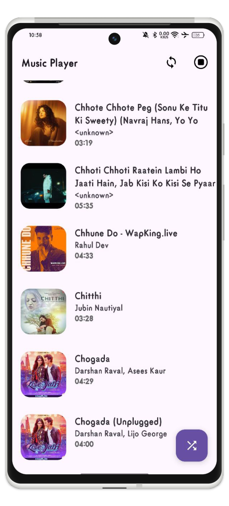
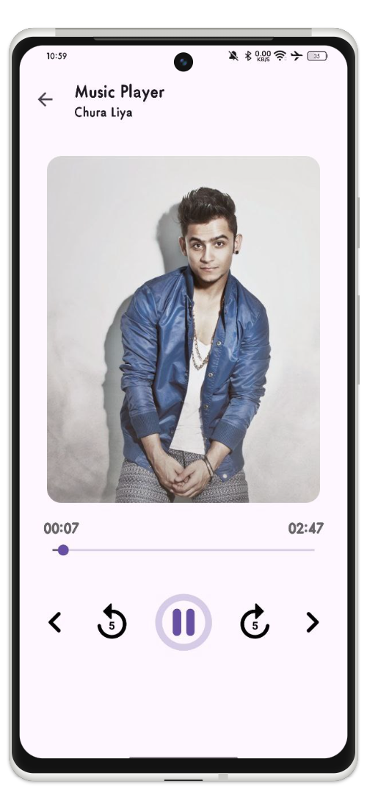

# MusicPlayer
This project is a demonstration of **MusicPlayer** in Kotlin, implementing the MVVM architecture.

## Download
- For debug build, please go to [Github Releases page](https://github.com/manojvermamv/MusicPlayer/releases)

## Screenshots

   
  

